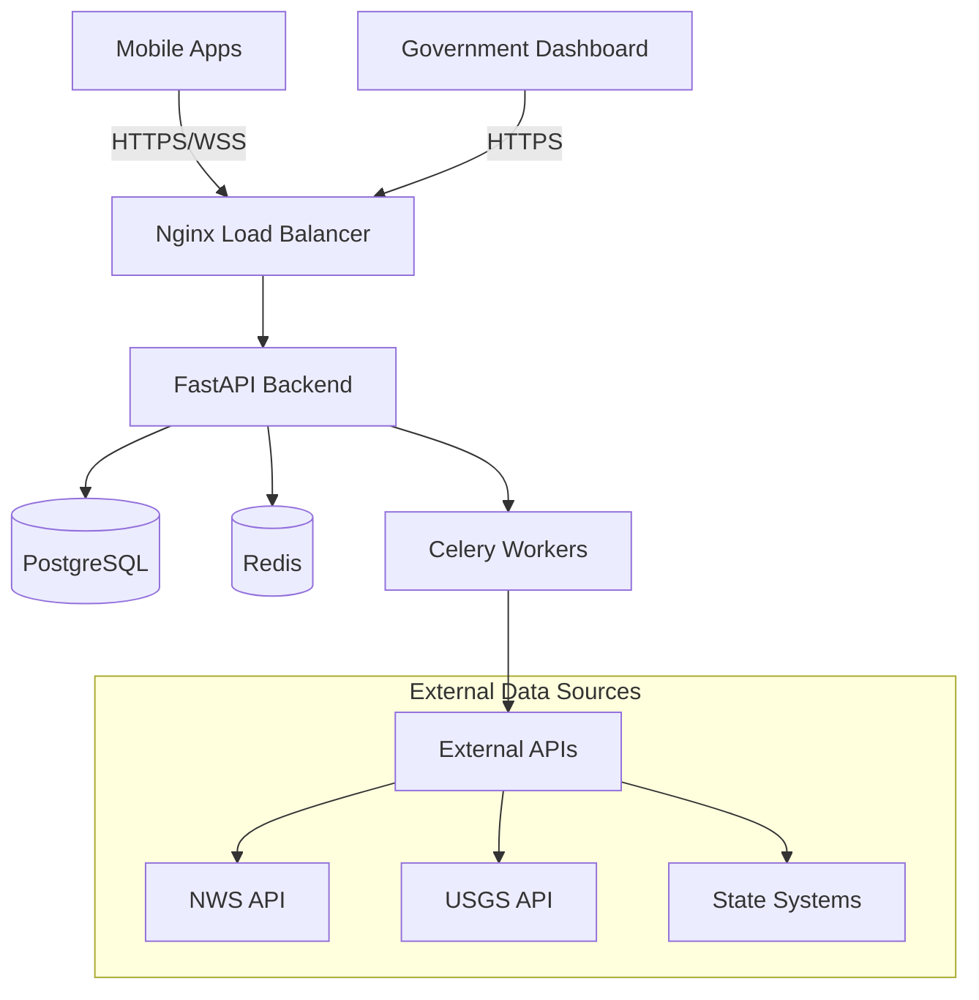

# 🌺 Hawaii Emergency Network Hub

<div align="center">
  
  
  <p align="center">
    <strong>A premium emergency alert aggregation system for Hawaii with enterprise-grade UI/UX</strong>
  </p>
  
  <p align="center">
    <a href="#features">Features</a> •
    <a href="#architecture">Architecture</a> •
    <a href="#quick-start">Quick Start</a> •
    <a href="#deployment">Deployment</a> •
    <a href="#contributing">Contributing</a>
  </p>
  
  <p align="center">
    
    
    
    
  </p>
</div>

## 🎯 Overview

The Hawaii Emergency Network Hub is a comprehensive emergency alert system designed to protect Hawaii's residents and visitors. It combines a consumer-facing mobile app with a government operations dashboard, providing real-time emergency alerts with premium UI/UX that rivals products from Apple/Google for consumers and Palantir/Tableau for government users.

### Key Objectives
- **Instant Alert Delivery**: Sub-30 second delivery from source to device
- **Multi-hazard Coverage**: Tsunamis, hurricanes, volcanoes, earthquakes, and more
- **Accessibility**: Support for multiple languages and accessibility features
- **Reliability**: 99.9% uptime with offline capabilities
- **User Experience**: Consumer-grade polish with government-grade functionality

## ✨ Features

### 📱 Consumer Mobile App (React Native + Expo)
- **Real-time Alerts**: Push notifications with rich media support
- **Interactive Maps**: Visualize danger zones and safe areas
- **Offline Mode**: Critical information cached for access without internet
- **Multi-language**: English, Hawaiian, Japanese, Korean, Tagalog, Chinese
- **Accessibility**: Full VoiceOver/TalkBack support
- **Emergency Resources**: Quick access to shelters, contacts, and evacuation routes
- **Haptic Feedback**: Physical alerts for critical warnings

### 🏛️ Government Dashboard (Next.js + shadcn/ui)
- **Operations Center**: Real-time monitoring of all active alerts
- **Alert Management**: Create, edit, and broadcast emergency alerts
- **Analytics Dashboard**: Response times, delivery rates, and user engagement
- **Multi-county Coordination**: Manage alerts across all Hawaiian islands
- **Audit Trails**: Complete history of all actions for compliance
- **WebSocket Monitoring**: Live view of connected users and system health
- **Report Generation**: Export data in multiple formats (PDF, Excel, CSV)

### 🔧 Backend API (FastAPI)
- **High Performance**: Async Python with WebSocket support
- **Type Safety**: Full Pydantic validation
- **Real-time Delivery**: WebSocket connections for instant updates
- **Scalable Architecture**: Redis caching and Celery task queues
- **Multi-source Aggregation**: Integrate with NWS, USGS, and local systems
- **Geographic Filtering**: Precise location-based alert targeting

## 🏗️ Architecture



### Tech Stack

#### Frontend
- **Mobile**: React Native, Expo SDK 51, NativeWind, Zustand, React Query
- **Web**: Next.js 14, TypeScript, Tailwind CSS, shadcn/ui, Recharts
- **Shared**: TypeScript types, Zod schemas

#### Backend
- **API**: FastAPI, Pydantic, SQLAlchemy, Alembic
- **Real-time**: WebSockets, Redis Pub/Sub
- **Tasks**: Celery, Redis, Flower
- **Database**: PostgreSQL, Redis

#### Infrastructure
- **Containers**: Docker, Docker Compose
- **Proxy**: Nginx with rate limiting
- **Monitoring**: Prometheus, Grafana, Sentry

## 🚀 Quick Start

### Prerequisites
- Node.js 18+ and npm
- Python 3.11+
- Docker and Docker Compose
- Expo CLI (`npm install -g expo-cli`)

### Local Development

#### 1. Clone the Repository
```bash
git clone https://github.com/yourusername/hawaii-emergency-hub.git
cd hawaii-emergency-hub
```

#### 2. Backend Setup
```bash
cd backend
python -m venv venv
source venv/bin/activate  # On Windows: venv\Scripts\activate
pip install -r requirements.txt

# Copy environment variables
cp .env.example .env
# Edit .env with your configuration

# Run migrations
alembic upgrade head

# Start the server
uvicorn app.main:app --reload
```

#### 3. Mobile App Setup
```bash
cd mobile
npm install

# Start Expo
npx expo start

# Press 'i' for iOS simulator
# Press 'a' for Android emulator
# Scan QR code with Expo Go app on your phone
```

#### 4. Government Dashboard Setup
```bash
cd web-dashboard
npm install

# Copy environment variables
cp .env.example .env.local
# Edit .env.local with your configuration

# Start development server
npm run dev
```

### Using Docker (Recommended)

```bash
# Start all services
./deploy.sh start

# View logs
./deploy.sh logs

# Run tests
./deploy.sh test

# Stop services
./deploy.sh stop
```

## 🌐 Deployment

### Production Deployment

#### 1. Environment Configuration
Create production `.env` files for each service with proper secrets and API keys.

#### 2. SSL Certificates
Place SSL certificates in `nginx/ssl/` directory.

#### 3. Deploy with Docker
```bash
# Build and deploy
docker-compose -f docker-compose.prod.yml up -d

# Run migrations
docker-compose exec backend alembic upgrade head
```

#### 4. Mobile App Deployment
- **iOS**: Build with EAS Build and submit to App Store
- **Android**: Build with EAS Build and submit to Google Play

```bash
# Install EAS CLI
npm install -g eas-cli

# Configure EAS
eas build:configure

# Build for iOS
eas build --platform ios

# Build for Android
eas build --platform android
```

## 📊 Performance Metrics

### Target Performance
- **API Response Time**: < 100ms (p95)
- **WebSocket Latency**: < 50ms
- **Alert Delivery**: < 30 seconds end-to-end
- **Mobile App Start**: < 2 seconds cold start
- **Dashboard Load**: < 3 seconds initial load
- **Concurrent Users**: 100,000+ supported

### Monitoring
- Health checks at `/health`
- Metrics endpoint at `/metrics`
- WebSocket stats at `/ws/stats`

## 🧪 Testing

### Run All Tests
```bash
./deploy.sh test
```

### Backend Tests
```bash
cd backend
pytest
pytest --cov=app  # With coverage
```

### Mobile Tests
```bash
cd mobile
npm test
npm run test:e2e  # End-to-end tests
```

### Dashboard Tests
```bash
cd web-dashboard
npm test
npm run test:e2e  # End-to-end tests
```

## 📱 API Documentation

### Interactive API Docs
- Swagger UI: `http://localhost:8000/docs`
- ReDoc: `http://localhost:8000/redoc`

### Key Endpoints
```
GET    /api/v1/alerts              # List alerts
GET    /api/v1/alerts/{id}         # Get alert details
POST   /api/v1/alerts              # Create alert (admin)
GET    /api/v1/alerts/nearby/me    # Get nearby alerts
WS     /ws/alerts/{user_id}        # WebSocket connection
```

## 🤝 Contributing

We welcome contributions! Please see our [Contributing Guide](CONTRIBUTING.md) for details.

### Development Process
1. Fork the repository
2. Create a feature branch (`git checkout -b feature/amazing-feature`)
3. Commit your changes (`git commit -m 'Add amazing feature'`)
4. Push to the branch (`git push origin feature/amazing-feature`)
5. Open a Pull Request

### Code Style
- **Python**: Black, isort, flake8
- **TypeScript**: ESLint, Prettier
- **Commits**: Conventional Commits

## 📄 License

This project is licensed under the MIT License - see the [LICENSE](LICENSE) file for details.

## 🙏 Acknowledgments

- Hawaii Emergency Management Agency
- National Weather Service
- United States Geological Survey
- All contributors and beta testers

## 📞 Contact

- **Project Lead**: [Your Name]
- **Email**: contact@hawaii-emergency.gov
- **Website**: https://hawaii-emergency.gov

---

<div align="center">
  <p>Built with ❤️ for the people of Hawaii</p>
  <p>🌺 Aloha and stay safe! 🌺</p>
</div>